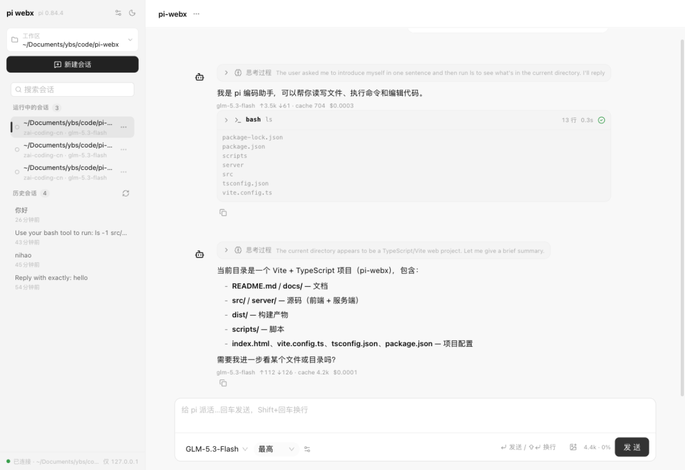

# pi webx

A local web UI for the `pi` coding agent, built with [LobeHub UI](https://ui.lobehub.com/)
and modelled on LobeChat's layout.

The agent runs **in-process** through the pi SDK (`@earendil-works/pi-coding-agent`) — one
`AgentSession` per conversation hosted by a small Express bridge. There is no subprocess and
no dependency on a CLI on PATH: pi's own config dir (`~/.pi/agent`) supplies models, auth and
extensions, so everything configured in the pi CLI keeps working.

Conversations stream in real time, tool calls render as expandable cards, agent-emitted UI
renders **inline in the conversation**, and extension dialogs are answered through the UI.



## Quick start

```bash
npm install
npm run dev        # bridge on :8787 + Vite on :5173  → open http://127.0.0.1:5173
```

Production (single process, serves the built SPA and the API):

```bash
npm run build
npm start          # → http://127.0.0.1:8787
```

Requirements: Node 20+ only. The bridge logs the embedded pi SDK version at startup.

## What it covers

**Conversation.** Streaming text and thinking blocks, tool calls as expandable cards with
live output, token/cost usage per turn, context-window usage in the composer bar, queued
steer/follow-up messages, retry and compaction banners, image attachments (paste or pick).

**Auto-rendered component views (a2ui-style).** The bundled pi extension
(`extensions/pi-webx-ui.ts`, deployed to `~/.pi/agent/extensions/`) registers a `render_ui`
tool. The agent calls it with a declarative JSON spec and the UI renders real components
**inline in the conversation, where the call happened** — layout (`row`/`col`/`card`/
`divider`), typography (`title`/`text`/`md`), data (`stat`, `table`, `desc`, `tags`,
`callout`, `code`, `list`), forms (`input`/`select`/`checkbox`/`switch`/`button`/`btngroup`/
`form`) and SVG charts (`line`/`bar`/`area`/`pie`). A fenced ` ```a2ui ` block in assistant
text renders the same way. Buttons and form submits send their `action` text back to pi as a
new message, closing the loop. The 「组件库」 drawer (sidebar) renders a gallery of every
component.

**Model selection.** One unified picker in the composer: click for a two-pane popover —
providers on the left with model counts, models on the right with context-window / reasoning
/ image tags, a search box, and the thinking level as a segmented control. No duplicate
dropdowns.

**Model configuration.** The 「模型配置」 view edits **pi's own** `~/.pi/agent/models.json`
(the file the pi CLI also reads; pi hot-reloads it). Two panes: providers on the left,
fields + model table on the right. API keys never reach the browser — reads return only how
a key is supplied (shell command / `$ENV` / stored literal, masked), and a blank key field
keeps the configured value. Writes are atomic, preserve unknown fields, and take a one-time
backup.

**Session management.** One unified, searchable list: live sessions on top (streaming
indicator), history grouped 今天 / 昨天 / 近 7 天 / 更早 below. Rename, switch, kill, resume,
delete-from-disk (path-guarded), export-to-HTML.

**Workspace configuration.** A workspace switcher with saved workspaces (persisted),
stored-session counts, directory browsing, set-default, and remove. History filters to the
current workspace; the last workspace reopens on boot.

## Architecture

```
browser  ──SSE──►  bridge (Express, 127.0.0.1:8787)  ──in-process──►  AgentSession (pi SDK)
         ◄─POST──
```

One `AgentSession` per conversation, created with `createAgentSession()`. The bridge relays
the session's event stream to the browser over SSE and maps pi's command vocabulary
(`prompt`/`steer`/`set_model`/`compact`/…) onto session methods — so the wire protocol is
unchanged from the earlier subprocess design, only the engine differs.

- `server/pi/host.ts` — the session host: registry, event fan-out, command dispatch.
- `server/models-config.ts` — atomic CRUD over pi's `models.json`.
- `src/shared/protocol.ts` — the wire contract.
- `src/shared/uikit.ts` — the component-spec schema plus `normalizeUiSpec`.
- `src/lib/usePiSession.ts` — the React bridge: SSE, dialogs, statuses, widgets.
- `src/components/uikit/` — the spec renderer and showcase.

### How state stays correct

- **Snapshot + fold.** On every SSE connect the client re-reads `get_messages` and rebuilds
  the transcript, then folds live events in — reconnects self-heal.
- **Cumulative vs delta.** `tool_execution_update.partialResult` is cumulative → replace;
  `message_update` carries no snapshot → assemble from deltas; `message_end` is authoritative.
- **Config-changing commands re-read state**, so the header tracks pi instead of drifting.
- **Specs are data.** Unknown component kinds are dropped, never evaluated, and specs are
  bounded (400 nodes / depth 12). `action` strings are sent to pi as user messages — and pi
  has shell access, so treat them like typed prompts.

## Security posture

This UI can run arbitrary shell commands on your machine, by design — that is what a coding
agent does.

- The bridge binds to `127.0.0.1` only, never `0.0.0.0`.
- The bridge makes **no outbound network requests** (model/provider traffic is the agent's
  own, in-process). The only `fetch` in the codebase is browser-side and same-origin.
- Directory browsing and session deletion are path-guarded.

## Scripts

| Command | What it does |
| --- | --- |
| `npm run dev` | bridge (watch) + Vite dev server |
| `npm run build` | production bundle into `dist/` |
| `npm start` | production: SPA + API on `http://127.0.0.1:8787` |
| `npm run typecheck` | `tsc --noEmit` across `src/` and `server/` |
| `npx tsx scripts/check-transcript.ts` | 20 assertions over the transcript reducer |

## Configuration

| Env var | Default | Purpose |
| --- | --- | --- |
| `PI_WEBX_PORT` | `8787` | bridge port (Vite dev proxy follows it) |
| `PI_WEBX_PROVIDER` | *(pi's default)* | provider for sessions created without an explicit one |
| `PI_WEBX_MODEL` | *(pi's default)* | model for those sessions |

`PI_WEBX_PROVIDER` / `PI_WEBX_MODEL` matter when pi's configured default provider is not
usable — without them, a broken credential surfaces as an *empty* assistant reply rather
than a loud failure. User preferences (last workspace, default model) persist in
`localStorage` under `pi-webx-prefs`; the theme choice sits in `pi-webx-theme`.

## Known gaps

- Extension **dialogs** (`select`/`confirm`/`input`/`editor`) are serviced by pi's mode
  layer, which the plain SDK does not expose — in SDK mode they resolve with defaults rather
  than prompting the user. Fire-and-forget extension UI (`notify`/`setStatus`/`setWidget`)
  works via the event stream.
- `get_commands`, `export_html`, direct `bash`, and the `set_auto_*` settings are not yet
  mapped to SDK calls; the bridge reports them as unsupported and the UI degrades with a
  notice.
- Live sessions are in-memory: restarting the bridge ends them. Persisted conversations
  remain resumable from the history list.
- No automated browser tests. UI was verified by driving it manually; antd dropdown-option
  clicks proved unreliable to automate.
- Models often emit the `render_ui` spec as a JSON-encoded string; both the extension and
  `normalizeUiSpec` unwrap that (up to two levels).
