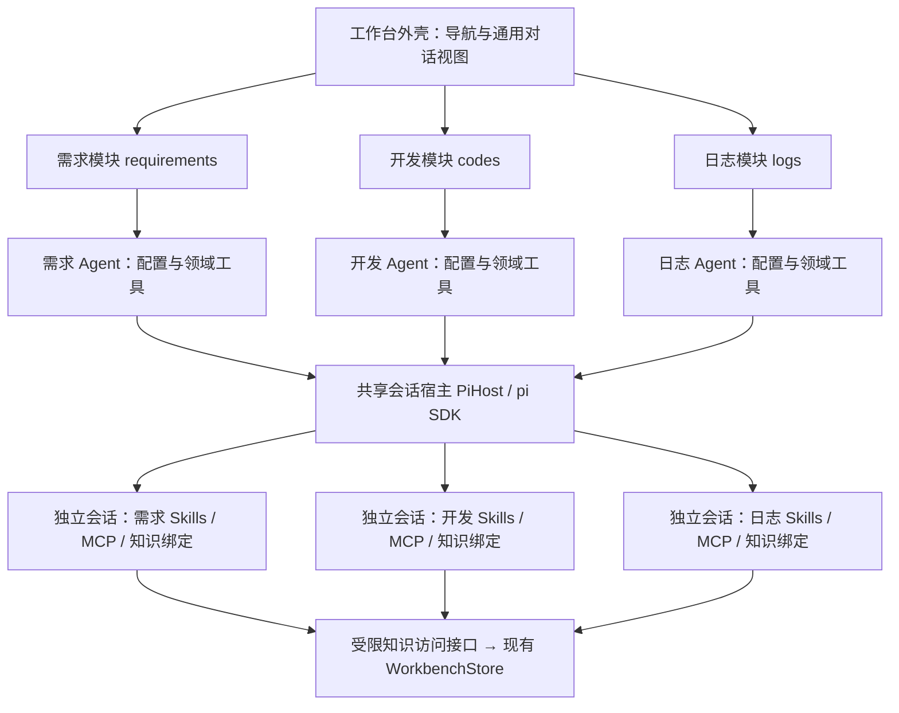

# 工作台三个独立 Agent：设计与实施交接

## 模块 Agent 设置服务（2026-09-28 增量）

左侧导航的 **Agent 配置**页面分别选择 logs、requirements、codes，编辑提示词、模型并勾选 Skill。`GET/PUT /api/module-agents/:agentId/settings` 在原会话路由之前挂载。Skill 候选只取 `config/agents/<id>.yaml` 的 `skills` 声明：字符串路径默认启用，也可写 `{path: ./skills/.../SKILL.md, enabled: false}`。GET 读取显式声明的 SKILL.md 元数据并返回 key、name、description、selected，不扫描模块目录、不返回正文或 editable 字段。PUT 必须逐一提交全部已声明 key 的选择状态，只写提示词、模型、enabled 标记及必要的 `skills.read` 工具声明；不创建或修改 Skill 文件。取消勾选保留 YAML 候选，重新进入可再次启用。更新按模块串行、检查 revision，暂存后原子替换，验证失败回滚。

保存成功后将新 profile 发布到会话路由共用的 map：**新对话采用新配置，已有对话按原快照恢复**。加载器只快照选中 Skill 及其补充资源；未选项不进入自动 Skill 清单和 `skills_read`。全部禁用时不注册 `skills_read`，包括手写 YAML 遗留 `skills.read` 的情况，其他未知工具仍报错。其余工具、MCP、知识范围和 `enabled` 保持 YAML 原设置。未注册实现的 requirements/codes 仍禁用，但可编辑配置。模型选择以本机运行时目录校验，不改全局默认模型。`PI_WEBX_AGENT_CONFIG_DIR` 若设置，必须是绝对路径；服务启动时加载、编辑和后续会话共用同一个根，便于用临时克隆进行验收。

> 日期：2026-09-28。状态：**P1 修复与可替换数据源接入层已实现，P2/P3 未完成**（分支 `devin/module-agents-p1`）。
> 本文依据当前 pi-webx 源码和本机 DeepSeek Harness 源码核对。用户明确要求与设计建议分开标记；不把建议当成已经确认的业务决策。

## 当前代码目录（2026-09-28 结构整理）

工作台八个前端模块已各自归入 `src/workbench-app/modules/<id>/`，由 `index.jsx` 公开页面；原 `modules/X.jsx` 只保留无业务逻辑的兼容 re-export。日志 Agent 的欢迎语、建议和输入占位位于 `modules/logs/agent-ui.js`，通用面板从 `agents/definitions.js` 接收模块定义。模块会话标识和配置装配语义不变。

后端已有领域字段归入 `server/modules/{tasks,works,fixes,logs,requirements,codes,knowledge}/schema.mjs`；`knowledgeBases` 与 `knowledgeFolders` 归 knowledge。`server/workbench/schema.mjs` 聚合模块字段，`schema-fields.mjs` 维护公共字段校验，`store.ts` 继续负责 SQLite。日志工具从 `server/modules/logs/index.ts` 暴露；通用受限 `knowledge_*` 工具位于 `server/modules/knowledge/tools.ts`，继续通过 `server/module-agents/knowledge.ts` 的 KnowledgeAccess 在服务端检查作用域并截断输出。旧 `server/module-agents/logs/tools.ts` 仅为兼容 re-export。`server/module-agents/` 保留配置加载、会话装配、MCP 与知识作用域等公共机制；`server/pi/` 和 `server/data-sources/` 保留共享能力。没有后端业务的 dashboard 不建立空目录，未实现的需求/代码 Agent 也不建立占位服务。`config/agents/` 仍是配置、提示词和 Skills 的唯一集中维护根。

## 框架接入修订（2026-09-28）

用户进一步明确：框架使用方自行接入非标准日志、问题清单接口，数据源可能整体替换。增加统一领域契约及可插拔转接层，接入规范与当前验收见 [数据源适配器](data-source-adapters.md)。日志 Agent 已通过稳定工具访问本地/HTTP/代码适配器；需求及代码 Agent 仍为禁用占位。

## 实施评审修订（2026-09-28）

开工前对照源码复核，以下五条覆盖正文中的对应表述：

1. **依赖**：仓库当前没有 YAML 解析器和 MCP 客户端 SDK。新增 `yaml`（用 `uniqueKeys` 拒绝重复键）与 `@modelcontextprotocol/sdk`；均选发布满 7 天的版本。
2. **`refreshSubagentTool` 会整体替换 `hosted.customTools`**（`splice(0, length, ...tools)`），不只是追加派工工具。模块会话的领域工具若放在 `customTools`，在 create/reset/fork 后会被清空。因此 `HostedSession` 增加 `moduleAgent?: AgentScope`，`refreshSubagentTool`、`applyInitialToolSelection`、`setToolSelection`（`withExtensionTools` 合并）以及 `set_tools` 命令对模块会话一律短路/拒绝；模块会话的工具面只由装配路径决定。
3. **去掉 `modelRef`**：宿主已有 `syncModelConfig` + `resolveCliModel`，不传即部署默认模型。YAML 改为可选 `model: { provider, id }`，缺省即默认；不引入别名解析。
4. **容量预留推迟到 P3**：`SessionCapacity` 是全局计数器，按模块预留名额要改容量模型。首版在 prompt 发送入口限制每模块同时运行会话数（`limits.maxRunningSessions`），恢复不会占用执行名额，全局上限沿用 `MAX_SESSIONS`。
5. **知识受限检索需新 Store 入口**：`store.search` 是跨全部模块的全局 LIKE 搜索，无按库过滤。在 `WorkbenchStore` 增加 `searchKnowledge(baseIds, query, limit)` 与 `readKnowledge(id)`（返回含 `knowledgeBaseId` 的记录，由调用方核对归属），不改现有搜索；`knowledgeRefs` 已按库解析双链，可复用。

## 阅读结论

将需求管理、代码开发、日志查询分别做成一个拥有独立配置、会话、Skills、MCP 和知识访问范围的 Agent 模块；三个模块是平级关系。第一版采用**一个应用、一个共享会话宿主、三个独立能力装配入口**，保留 pi SDK，借鉴 DeepSeek Harness 的组件边界。先完成模块独立运行和故障隔离，再考虑跨模块协作、远程部署或更换运行时。

目录：[需求与边界](#intent) · [现状证据](#current) · [Harness 借鉴](#harness) · [总体结构](#structure) · [模块职责](#modules) · [配置与装配](#composition) · [会话生命周期](#sessions) · [Skills](#skills) · [MCP](#mcp) · [知识库](#knowledge) · [接口与目录](#implementation) · [实施顺序](#delivery) · [验收](#acceptance) · [决策与参考](#references)

<a id="intent"></a>
## 1. 需求与设计边界

### 1.1 已明确的要求

| 用户原话 | 本次设计必须满足 |
| --- | --- |
| “工作台有需求管理，有代码开发，日志查询，这三个” | 第一阶段只围绕 `requirements`、`codes`、`logs` 建立 Agent 能力 |
| “每个都是一个独立的 agent” | 各自可进入、可对话、可运行、可恢复；不依赖另一个业务 Agent 才能使用 |
| “都可以加载独立的 skill 和 mcp 以及自己的知识库” | 三类资源按模块分别配置、装配和限制访问 |
| “json文件配置改为yaml配置，并且统一放到一个目录下进行维护” | Agent 配置统一使用 YAML，集中在 `config/agents/`；实现代码与配置分离 |
| “参考最小独立设计原则……组件化概念” | 共享稳定机制，业务逻辑留在自己的模块；组件依赖明确接口 |
| “每个功能模块的逻辑都尽量互不影响” | 配置变更、状态、异常和日常开发尽量局限在所属模块 |
| “整理成文档，我让其他人进行开工实现” | 交付可执行的边界、改造位置、分工和验收；本轮仅编写文档 |

### 1.2 推断及建议

- **【推断】**“独立”首先指业务和运行状态独立，未明确要求三个进程、三套部署或三个模型。依据是“功能模块的逻辑都尽量互不影响”。
- **【建议】**一个模块对应一种 Agent 定义，可以拥有多段会话；不是每个模块永远只有一段聊天，也不是三份进程常驻。
- **【建议】**独立配置允许三者选择同一个模型、引用同一份只读 Skill 文件；共享文件不等于共享可变运行状态。
- **【建议】**保留现有工作台导航、业务记录和知识库页面；为三个模块分别增加 Agent 入口及配置展示。
- **【建议】**首版不做自动“需求 → 开发 → 日志”流水线，不增加总指挥 Agent、任务调度平台、动态插件市场或新的微服务。

### 1.3 “独立”的准确含义

| 维度 | 第一版必须做到 | 第一版的实际边界 |
| --- | --- | --- |
| 业务 | 模块可单独挂载、禁用和测试，不 import 其他模块的私有实现 | 仍共享工作台外壳 |
| 资源 | 独立的提示词、工具白名单、Skill 清单、MCP 配置、知识库绑定 | 可显式引用相同的只读资源 |
| 会话 | 历史、队列、取消、弹窗、草稿、恢复标识各自归属 | 共享 pi SDK 和现有事件协议 |
| 故障 | 模块配置错误、工具失败、MCP 超时只报告给所属会话/模块 | 进程崩溃、数据库故障、共同模型服务故障仍可能影响全部 |
| 数据 | 模块工具在服务端检查业务及知识作用域 | 同一 SQLite 文件中的逻辑隔离，不等于独立数据库 |
| 安全 | 不把提示词、cwd 或前端筛选当成权限控制 | 拥有任意 Shell/文件权限的可信代码 Agent 不具有 OS 级隔离保证 |

若以后要求“一个模块崩溃后另两个进程仍继续”或“恶意代码无法读到其他模块数据”，再引入进程/原生沙箱边界。不能把本方案宣传为已经满足这些要求。

<a id="current"></a>
## 2. 现状：可以复用什么，实际缺少什么

核对基线：pi-webx `9fc4f3eebf1bb37e779afeb63008ea01c70cbfa9`。以下是源码事实，不是本轮运行验收。

| 位置 | 已核对事实 | 改造含义 |
| --- | --- | --- |
| `src/workbench-app/App.jsx` | 外壳调用一次 `useWorkbenchPiChat()`；`askAI(text)` 发往统一 AI 面板 | 模块入口必须显式选择 Agent，不能继续共用唯一会话状态 |
| `src/workbench-app/pi-webx/useWorkbenchPiChat.jsx` | 统一缓存键 `ai-workbench.pi-session-id`；新会话仅传名称 | 需要按工作区和 Agent 分别恢复，服务端保存不可变身份 |
| `src/workbench-app/modules/Requirements.jsx` | 需求记录搜索、查看、编辑、状态变化走工作台 CRUD | 可作为需求 Agent 的领域操作基础 |
| `src/workbench-app/modules/Codes.jsx` | “文件树”按开发事项分组，编辑器保存 `codes.note` | 不是磁盘文件 IDE；真实仓库选择、改文件、执行验证需另接能力 |
| `src/workbench-app/modules/Logs.jsx` | 对 `data.logs` 做本地筛选，可维护工作台日志记录 | 不是已经连接外部日志平台；先用现有记录完成真实查询闭环 |
| `server/pi/host-session-assembly.ts` | 通过 `createAgentSession` 创建会话；使用 `getAgentDir()` 和默认资源加载器 | 增加模块专属装配路径，约束默认资源发现及工具注入 |
| `server/pi/host-events.ts` | 已有按会话事件流、队列、请求关联机制 | 复用；不要再建一套 Run/Event/Scheduler 真相源 |
| `server/tool-selection.ts` | 普通工具预设会合并所有扩展工具 | “只读预设”不足以保证日志 Agent 只读，必须检查扩展/MCP 工具 |
| `server/workbench/schema.mjs`、`store.ts` | 已有 `knowledgeBases`、`knowledgeFolders`、`knowledgeBaseId`；双链按库解析 | 复用知识库实体，新增 Agent 绑定与受限访问即可 |
| `extensions/pi-webx-knowledge.ts` | 已有知识工具，但搜索全库、读取全量 state 后找 id，写入未绑定专属库 | 不能原样作为三个 Agent 的隔离知识工具 |

在所检查的 `server/`、`extensions/`、`src/shared/` 和 `package.json` 中未发现模块级 MCP 客户端实现。用户机器可能另有全局扩展，本文不把它们视为产品已具备的能力。旧知识协议文档部分状态已落后于源码，实施前以现有代码及测试核实。

<a id="harness"></a>
## 3. 从 DeepSeek Harness 借鉴什么

参考本机 `deepseek-harness`，基线 `477b4f420553e8a52c2fbccc464d7561b239c443`。该 checkout 有其他工作中的改动；本次只读研究，所引用的 preset、scope、skill、mcp 和 capability-seams 文件未见本地修改。本文不声称这是远端最新版本。

| Harness 的实际做法 | 本项目采用的原则 | 本项目的最小实现 |
| --- | --- | --- |
| Service Definition / Service Provider / Consumer 分工 | 使用方依赖稳定契约，实现可替换 | TypeScript 接口 + 显式构造注入；不引入 Cordis 容器 |
| Agent preset 声明子插件，Host 共享 loop | 共享执行机制，按 Agent 装配能力 | 三份配置 + 三个领域模块工厂 + 同一个 PiHost |
| Scope 管理可见性和资源释放 | 谁创建资源，谁拥有并负责销毁 | 每个会话持有自己的工具注册、连接和清理函数 |
| Preset 使用代际，活动 Agent 保持已选组合 | 更新配置不能在一轮执行中换工具/提示词 | 会话固定配置版本；更新仅作用于新会话 |
| Skill 注册表、文件来源、加载工具分离 | YAML 候选声明与使用解耦 | 显式 Skill 清单 + 按需读取；首版只需要文件来源 |
| MCP 客户端拥有连接，工具带服务器命名空间 | 外部能力有明确身份和生命周期 | 模块/会话专属客户端，受限工具映射和确定性释放 |

Harness 的 capability-seams 设计还明确强调：只有一个可预见实现和一个使用方时，不要预先拆包。这里借鉴的是边界和生命周期，**不复制其全部插件包、HMR、配置语言与产品组织方式**。其 Service Definition 是 Cordis Service；本项目采用 TypeScript 接口是有意做的简化，不是逐字移植。

<a id="structure"></a>
## 4. 总体结构与依赖规则



图中共享方提供机制，独立会话才拥有状态。模块没有彼此调用关系。

1. 领域模块只依赖公共契约和注入的能力，不互相 import；仅应用组合根知道三者名单。
2. `PiHost` 管会话生命期，pi 管模型执行；领域服务管业务校验，WorkbenchStore 管记录持久化。
3. 通用层不得通过大量 `if (agentId === ...)` 承载业务规则；通过注册的模块工厂选择行为。
4. 通用 AI、既有子智能体和 Agent Team 保持现有语义。三个模块 Agent 不以父子关系接入 Agent Team。
5. 共享组件复用代码；单例变量不得保存“当前 Agent 的工具/知识库/会话”。
6. 先允许一个进程内部件独立开关和测试；不为目录对称创建三个数据库、三个后端和三个聊天渲染器。

<a id="modules"></a>
## 5. 三个模块各自负责什么

| 模块 | 核心职责与结果 | 默认工具范围 | 专属知识 |
| --- | --- | --- | --- |
| `requirements` 需求 Agent | 澄清需求、整理约束和验收条件；输出需求草稿并按操作意图保存需求记录 | 需求查询/读取/新增/修改；知识检索与维护；显式配置的需求 MCP | 业务术语、产品规则、已确认需求、需求模板 |
| `codes` 开发 Agent | 理解选定仓库、提出方案、修改代码、执行验证；输出真实 diff 和验证结果 | 受工作区约束的文件读写、搜索、命令执行；开发事项记录；开发 MCP | 架构说明、代码约定、验证命令、已验证修复经验 |
| `logs` 日志 Agent | 将自然语言转为查询、分析日志、引用证据并提出排查建议 | 有界日志 search/read/aggregate；只读日志 MCP；自己的分析报告/知识写入 | 服务说明、字段解释、查询模板、已验证故障模式 |

边界约定：需求 Agent 不自动调用开发 Agent；日志 Agent 不自动修代码、重启服务或更改原始日志；代码 Agent 不自动改写其他模块的业务记录。现有 UI 手工管理日志的功能可以保留，但它不等于给日志 Agent 开放日志修改工具。

每个模块 Agent 的 cwd 绑定到服务端核验后的独立工作区目录，不能直接使用 `codes.project` 这个自由文本分组字段。Agent 配置页可选择独立默认目录或绑定已有目录，YAML 使用可选 `workspace` 字段；默认目录为 `~/.pi-webx/workspaces/agents/<id>`。新绑定对新对话生效，已有会话及恢复继续使用原始目录。不同 Agent 不可绑定同一目录或父子目录，符号链接按真实路径比较。代码页切换项目时同步保存代码 Agent 的绑定，随后让 IDE 和新会话使用同一目录；开发事项备注与磁盘文件使用不同的数据类型和工具。

将来确有跨模块协作需要时，先支持用户显式传递一份带来源的结果副本或引用。目标 Agent 创建自己的上下文，不共享活跃会话，不直接写对方数据库；无需预建消息总线。

<a id="composition"></a>
## 6. 配置与能力装配

### 6.1 最小配置

按用户明确要求，三个 Agent 配置统一维护在仓库根目录的 `config/agents/`：`requirements.yaml`、`codes.yaml`、`logs.yaml`，每个 Agent 一份文件。提示词和 Skills 放在该目录的 `prompts/`、`skills/` 子目录；业务实现位于 `server/modules/<id>/`，公共 Agent 装配位于 `server/module-agents/`。集中维护不改变三个 Agent 各自的资源边界。

以下为 `config/agents/logs.yaml` 示例；这些字段由本项目加载器解释，不是 pi SDK 原生字段。`skills` 的字符串项默认启用，需要保留候选但关闭时可改为 `{path, enabled: false}`。

```yaml
schemaVersion: 1
id: logs
enabled: true
promptFile: ./prompts/logs.md
modelRef: configured-default
skills:
  - ./skills/logs/log-analysis/SKILL.md
tools:
  - logs.search
  - logs.read
  - knowledge.search
  - knowledge.read
  - knowledge.create
  - knowledge.update
mcp:
  - id: log-source
    enabled: false
    required: false
    connection:
      transport: streamable-http
      url: https://logs.example.invalid/mcp # 占位地址，接入时替换
      headerRefs:
        Authorization: LOGS_MCP_AUTHORIZATION # 引用服务端环境变量中的完整请求头值
    tools: [search_logs, get_log]
    resources: false
    timeoutMs: 15000
knowledge:
  homeBinding: logs
  sharedReadBindings: []
limits:
  maxRunningSessions: 1
  maxToolOutputChars: 24000
```

- `modelRef` 解析到现有模型配置；`configured-default` 是本文示例别名，需要实现解析。独立 Agent 不要求不同模型，不复制账号凭据。
- `tools` 列领域/内置工具；MCP 工具由各连接下的 `tools` 明确列举，汇成最终能力集。未知名称报配置错误，不默默开放全部工具。
- MCP 的 `connection` 定义直接写在所属 Agent 的 YAML 中：stdio 使用 `command/args/cwd/envRefs`；Streamable HTTP 使用 `url/headerRefs`。`envRefs/headerRefs` 只保存服务端环境变量名称，真实凭据不写入 YAML；浏览器只拿脱敏信息。
- MCP 示例默认禁用，因为真实日志服务尚未指定；没有外部 MCP 时仍能查询现有工作台日志。
- `homeBinding` 是逻辑绑定名，不冒充数据库 id。初始化时幂等建立或选择真实知识库，并保存映射；共同只读库必须显式绑定。
- 默认不自动继承用户全局 Skills、MCP、扩展或通用工作台提示词。可共享内容逐项显式纳入。

### 6.2 配置真相源及版本

首版以 `config/agents/*.yaml` 为 Agent 配置的唯一真相源，不再从业务代码目录寻找配置，也不保留同名 JSON 配置回退。左侧 Agent 配置页面经设置服务校验并原子写回对应 YAML，尽量保留注释，不另存一套 SQLite 配置。

统一加载规则：

1. 应用启动时确定配置根目录的绝对路径，默认定位到应用根下的 `config/agents/`；部署时随应用分发。加载器只接收这一个根目录，不能随代码 Agent 的仓库 cwd 改变。
2. 启动和显式重新加载时，只扫描根目录直接子文件 `*.yaml`，按文件名稳定排序；不递归扫描 Skills 内的 YAML。文件名必须等于已注册的 `id`，未知 id、重复 id 单独报错，配置不能动态导入任意代码。
3. 使用标准 YAML 1.2 解析器，仅接受单文档数据；拒绝重复键、自定义执行标签和隐式脚本/模板求值。随后做统一 schema 校验，未知字段或类型错误明确指出文件与字段，能定位时附行列。
4. `promptFile`、Skills 路径及 stdio 连接中显式配置的相对路径，统一相对该 YAML 所在目录解析；可执行命令名仍按受控 PATH 解析。知识库逻辑绑定和环境变量引用不是文件路径。
5. 每个文件独立解析、校验、装配和发布配置版本；缺失或错误文件只使所属 Agent 不可用，不能阻断另外两个。运行历史、知识正文、配置快照和生成的绑定数据保存在现有运行数据目录，不写回配置目录。

运行时生成不可变 `profileRevision`：涵盖配置、提示词、Skills 及其引用资源的内容摘要、连接定义版本和知识绑定版本，不包含密钥值。持久保存可恢复的配置快照及所需资源快照；敏感值始终按引用读取。代码实现版本也记入诊断，但不承诺保存旧版程序可执行文件。

配置修改后校验成功才发布新版本，活动会话继续使用原版本。冷启动发现错误配置，只把该 Agent 标记为不可用；热更新失败保留上一个有效版本并显示错误。撤销资源权限时应停止受影响会话并要求新建，而不能让旧快照继续保留已撤销权限。

### 6.3 组装时强制收口

`扫描统一 YAML 目录 → 按 id 匹配模块定义 → 校验配置 → 固定身份/版本 → 创建受限工具和知识视图 → 加载显式 Skills → 连接启用的 MCP → createAgentSession → 就绪`。

当前安装的 pi SDK 暴露 `ResourceLoader`、`DefaultResourceLoader` 的 `noExtensions/noSkills/noContextFiles`、资源 override，以及 `createAgentSession` 的 `resourceLoader/customTools/tools` 等入口。实现先用这些公开 API 做最小隔离探针，再确定适配方式；只设置不同 `agentDir` 不足以证明没有加载项目资源。

最终可执行工具集必须等于配置允许集。`set_tools`、恢复会话、扩展刷新、MCP 重连、reset/fork 等路径都不能放宽它。普通 `withExtensionTools` 的“所有扩展工具合入”行为不得绕过模块策略；同样要阻止 `refreshSubagentTool` 默认给三个模块注入派工工具。

<a id="sessions"></a>
## 7. 会话身份与生命周期

### 7.1 身份由服务端绑定

```ts
type AgentId = 'requirements' | 'codes' | 'logs';
type AgentScope = Readonly<{
  agentId: AgentId;
  workspaceKey: string;
  sessionId: string;
  profileRevision: string;
}>;
```

- `workspaceKey` 来源于服务端登记/规范化的工作区身份；单工作区版本可以只有一个固定值。代码仓库根作为会话绑定单独核验，不采信客户端任意路径。
- 身份写进现有会话日志的版本化自定义条目，例如 `pi-webx:module-agent`，先于首次模型调用落地。会话日志是身份事实源，列表索引只是可重建投影。
- 前端缓存键建议 `ai-workbench.agent-session:{workspaceKey}:{agentId}`。它只是恢复指针，不能决定后端身份或资源权限。每个标签页用 sessionStorage 保留自己的指针，localStorage 仅作为“最近会话”默认值；其他标签页更新默认值不能切走当前会话。
- 恢复必须核对 Agent、工作区、配置快照和仓库绑定。缺少旧资源快照、实现不兼容时允许只读历史，并提示新建；不静默按最新资源续跑。
- 旧全局会话继续属于通用 AI，不自动归属任一模块；跨 Agent fork 首版拒绝。reset/new/fork 同模块时都必须重新经过模块装配路径。

### 7.2 生命周期规则

1. 懒创建：进入页面只加载能力状态；第一次对话时创建会话，避免启动就占满模型/连接容量。
2. 运行状态复用宿主和 transcript；每个会话串行，三个模块可以并行。每模块默认同时执行一段会话，多会话历史不受此限制。
3. 扩展现有容量控制，预留三个模块各至少一个活跃名额，保留全局上限；满额返回明确错误，不另建持久任务队列。
4. 页面切换仅切换订阅和视图；切走前捕获发送目标，异步回包按 scope 校验。草稿、pending、busy、弹窗、错误和取消按钮都按会话归属。
5. 停止只中止目标会话的模型和在途工具；正常取消仍保留可用会话及连接。销毁会话再释放连接、监听器、计时器和容量。
6. 挂载失败按创建的逆序回收已分配资源；MCP 停止和 dispose 必须幂等且有时限。服务端关停负责清理全部拥有的资源。
7. 进程重启恢复历史及配置身份；不自动重放未完成的文件写入、MCP 调用或业务写操作。将中断显示给用户，再决定是否继续。

业务记录状态独立于会话状态：模型回答“已完成”不直接把需求或开发事项标记为完成。记录写入必须通过领域服务获得实际成功结果；代码完成说明须带 diff 与验证证据。

<a id="skills"></a>
## 8. 独立 Skills

- Skill 是工作方法和指令，不是工具权限，也不是数据库。工具实现即使被 Skill 提及，也只有在配置允许时才能调用。
- 每个 Agent 只发布自己已选 Skills 的名称、说明和固定来源；正文按需加载。需求、代码、日志可分别提供需求澄清、仓库开发、日志分析 Skills。
- 同名 Skill 在同一 Agent 内报冲突，不依赖目录扫描顺序覆盖；不同 Agent 的同名 Skill 可以并存。
- 路径相对所属 YAML 的目录（`config/agents/`）解析并校验；共享 Skill 通过显式路径引用，例如 `./skills/shared/.../SKILL.md`。自定义加载器及脚本读取都应使用该会话固定的资源版本。
- 不能先让全局扩展执行，再从工具列表里隐藏它；默认自动发现必须在加载之前关闭或受控。SDK 的扩展主动追加资源路径也需接受同一白名单检查。
- 代码 Agent 可以显式加载所选仓库的工程指令；不得把仓库中自动发现的全部 Skills/MCP 顺带加入。必要的工程约束与可选能力分开处理。

<a id="mcp"></a>
## 9. 独立 MCP

首版采用成熟 MCP 客户端 SDK 适配，不自行实现协议。公共连接适配器只处理协议与生命周期，各模块声明自己的服务器和允许工具。

| 项目 | 规则 |
| --- | --- |
| 连接所有权 | 默认一段会话持有自己的客户端；不做跨 Agent 连接池。stdio 子进程由创建它的会话清理；远端 HTTP 服务仅断开客户端 |
| 工具命名 | 适配器生成稳定名称，如 `mcp__logs__log_source__search_logs`；规范化后冲突即报错，调用再反查白名单 |
| 初始化失败 | `required: true` 使本会话不可运行；可选连接失败则显示降级状态，不回退到其他 Agent 的 MCP |
| 运行失败 | 超时/取消结束当前调用；重连有次数与退避上限，销毁后不再重连；会话若失去必要能力应报告不可用 |
| 结果与资源 | 结果限制体积并标注截断；资源读取单独开关和限定范围；服务端 instructions 只加入所属会话 |
| 权限变化 | 工具列表变更仍与配置白名单取交集；不能因服务端新增工具而自动开放 |
| 凭据 | 仅按引用注入当前连接所需环境/请求头；不得将整个宿主环境或其他模块密钥传给子进程 |
| 重试 | 只自动重试已知安全的读操作；写入结果不确定时返回“结果待核实”，不能盲目重放 |

首个验收必须通过可控 MCP fixture 完成协议调用、取消与故障测试；外部服务地址、认证和真实工具 schema 未选定前，不能声称生产日志源已经接通。实现中使用了哪种传输就提供对应验收，不把未实现传输伪装成可用配置。

已用 stdio fixture（`scripts/mcp-fixture-server.ts` + `scripts/check-module-agent-mcp.ts`）完成 A03/A04 服务端验收；streamable-http 仅实现未验收。

<a id="knowledge"></a>
## 10. 每个 Agent 自己的知识库

### 10.1 复用已有存储，建立绑定

第一版继续使用 WorkbenchStore 及已有知识条目，每个工作区为三个 Agent 分别绑定一个可写知识库。建议映射为 `(workspaceKey, agentId) → homeKnowledgeBaseId`，外加显式 `sharedReadKnowledgeBaseIds`；真实 id 由服务端产生/核实，不靠库名判断。

这些映射由独立、小型绑定存储保存，唯一约束保证并发初始化幂等；它只存绑定，不复制知识正文。初始化最好与创建知识库处于同一数据库事务。现有知识不搬走、不自动复制三份；原有库保留，按需显式指定归属或共享只读。

### 10.2 作用域在服务端生效

提供绑定后的 `KnowledgeAccess`：`search/read/create/update`。scope 在装配时闭包绑定，模型参数不接受 `agentId`；多库读取只能选择已经绑定的库，写操作默认且仅写 home 库。

- `search` 在取结果、排序和 limit **之前**限制可读库；不能全库检索后只在前端隐藏。
- `read/update` 根据 id 找到记录后验证所属库；知道另一个库的 id 也不能越界读取/写入。
- `create` 由服务端填入 home 库；`update` 禁止借 `knowledgeBaseId/folderId` 把条目移入其他库。
- 出入链、标题解析、摘要、导出和缓存都遵守相同范围；隐藏条目的标题、数量、片段也不应通过工具结果泄露。
- 缓存键至少包含工作区、Agent、配置/知识绑定版本及查询条件。不得把三个 Agent 的检索结果存到一个仅按关键词索引的缓存。
- 写入沿用现有标题、正文、tags、refs 和时间戳语义；若独立 HTTP 路由与旧路由共存，两者调用同一领域服务，不复制写入校验。

旧 `knowledge` 扩展属于通用工作台访问口，不自动加载进模块 Agent。新增受限工具可同进程调用受限知识服务；跨进程消费者再走同语义的受限 HTTP API。现有全量 UI 接口不能作为模块工具的直接后门。

### 10.3 内容及检索策略

先用现有 SQLite 文本检索，接口保留 `query/limit/cursor` 即可；是否引入 FTS、向量检索或外部知识服务由实际规模决定。会话聊天记录与持久知识分开：不自动把每条对话写成知识；写入必须有清晰内容和来源，假设须标明尚未验证。

共享只读库写入不开放给三个模块；需要共同维护时以后明确唯一写入方。代码 Agent 的自由 Shell 仍可能绕过应用级访问口，因此本节保证的是受控工具的数据边界，不提供对恶意本机代码的隔离承诺。

<a id="implementation"></a>
## 11. 最小代码组织与接口

### 11.1 当前目录与后续实施边界

```text
config/agents/            # 配置及配套指令的统一维护入口
  requirements.yaml      # 需求 Agent 的完整配置，含自己的 MCP 定义
  codes.yaml             # 开发 Agent 的完整配置
  logs.yaml              # 日志 Agent 的完整配置
  prompts/               # requirements.md、codes.md、logs.md
  skills/                # requirements/、codes/、logs/；shared/ 按需显式引用
server/modules/
  tasks/ works/ fixes/ requirements/ codes/  # 各自现有业务字段 schema.mjs
  logs/                   # schema.mjs、领域 tools.ts、index.ts
  knowledge/              # 文档/库/目录 schema.mjs、受限知识 tools.ts
server/module-agents/
  contracts.ts            # AgentId、配置、scope、装配契约
  registry.ts             # 仅装配/查找模块，无业务逻辑
  profiles.ts             # 统一加载 YAML、校验、固定版本
  resources.ts snapshots.ts  # 配置资源快照与受限 Skill 读取
  knowledge.ts            # 绑定、受限 KnowledgeAccess，委托 WorkbenchStore
  mcp.ts                  # 协议客户端适配
  router.ts               # 模块能力/创建恢复入口
  logs/tools.ts           # 旧 deep import 兼容 re-export
server/workbench/
  schema.mjs              # 模块清单、领域 schema 聚合与校验入口
  schema-fields.mjs       # 所有数组模块共享字段校验
  store.ts router.ts      # SQLite 与工作台 HTTP
src/workbench-app/modules/
  dashboard/ tasks/ works/ fixes/ logs/ requirements/ codes/ knowledge/
                         # 每个目录以 index.jsx 公开页面，放专属 CSS/组件/辅助函数
  X.jsx                  # 旧页面路径仅兼容 re-export（X 为原大小写模块名）
src/workbench-app/agents/
  useModuleAgentChat.jsx   # 复用现有事件流；状态按 scope 隔离
  AgentCapabilities.jsx   # 当前模型、Skills、MCP、知识库与错误状态
  definitions.js           # 通用面板定义注册入口，日志文案在 modules/logs/
```

这是当前已实现路径的职责地图；未实现的业务服务不因目录对称而造空文件。后续需求/代码 Agent 的领域工具仍是未来工作。公共聊天正文继续复用 `TranscriptView`。

### 11.2 接口责任

| 接口/入口 | 责任 | 不应承担 |
| --- | --- | --- |
| `ModuleAgentDefinition` | id、配置来源、`createTools(deps)` | 管理其他模块或启动模型循环 |
| `ResolvedAgentProfile` | 一段会话固定的配置和资源白名单 | 全局“当前 Agent”可变状态 |
| `KnowledgeAccess` | 已绑定作用域的四项知识操作 | 让模型自行决定访问身份 |
| 模块领域服务 | 校验需求更新、仓库操作或有界日志查询 | 直接调用另一个模块 Agent |
| pi 装配适配器 | 将 profile/工具/loader 接入已有 host | 再创建一个独立会话调度器 |

建议新增 `GET /api/module-agents`（脱敏能力与状态）、`POST /api/module-agents/:agentId/sessions`（新建/恢复，传 `workspaceKey`、`requestId` 和可选旧会话 id）。同一创建请求重试必须幂等，恢复同一个会话的并发请求由宿主合并；不同标签页显式新建则允许得到不同会话。既有发送、取消、快照、事件流协议继续复用，以绑定后的 sessionId 寻址。

服务端创建入口禁止由客户端覆盖工具、配置快照、密钥和任意 sessionPath；恢复从已登记的会话 id 定位。**仅增加新路由不够**：既有命令、恢复、reset/fork、工具选择路径都必须读取会话绑定，防止旧入口产生无约束的模块会话。

### 11.3 现有文件接线范围

主要接线位于 `server/index.ts`、`server/pi/host-contract.ts`、`host-session-assembly.ts`、`host-commands.ts`、`host-teams.ts` 以及工作台外壳/聊天 hook；知识受限查询在 Store 的小范围入口补足。这些是实施时需核对的改造点，不意味着全部必须修改。

遵守仓库规则：尽量不动有门禁约束的 `server/routes.ts`；优先新 router 加共享 host 校验。保留已有 `data-testid`，新增交互补门禁；浏览器 API 进 effect 并带守卫；样式用模块前缀和现有令牌；不修改冻结的 `server/prompts/subagent/*.md`。新增实现后更新 `docs/code-map.md`。

<a id="delivery"></a>
## 12. 分阶段实施与人员分工

| 阶段 | 具体工作 | 完成条件及边界 |
| --- | --- | --- |
| P0：运行时探针 | 验证统一 YAML 加载与逐文件错误隔离；用当前 pi SDK 创建两个不同资源集会话，验证默认发现关闭、工具受限、恢复与释放；确认 MCP SDK 兼容性 | 得到真实工具/Skill 清单和取消证据；发现能力缺口先修适配器，不靠提示词假装隔离 |
| P1：一个垂直闭环 | 从日志 Agent 起步：现有工作台日志查询 + 一份 Skill + 专属知识 + 可控 MCP fixture + 独立会话与 UI | 查询有真实来源、超时可取消、重启可恢复历史；通用 AI 和旧页面回归通过 |
| P2：另外两模块 | 加需求记录操作及代码工作区；启用统一目录下的三份 YAML 配置和知识绑定；每个模块完成一次真实任务 | 需求能保存再读回；代码能修改受控测试仓库并执行检查；三模块同时使用互不串状态 |
| P3：故障与交接 | 配置错误、MCP 断连、越界 id、刷新、切页、取消、进程重启；补诊断与说明 | 下表验收通过；记录真实外部服务与尚未接入项；交付可运行说明 |

建议分工：公共运行时负责人拥有 contracts/profile/装配/路由；知识与 MCP 适配可分别由明确负责人维护；三个模块负责人只改自己的领域工具和视图。先冻结最小接口再并行；`App.jsx`、host 接线和 Store 迁移等共享文件由一个集成人负责合入，避免多人各写一套公共逻辑。

后续扩展触发条件：第二个真实知识后端出现再拆 Provider；多个模块确有通信需求再设计结果传递契约；需要独立崩溃域/资源配额再拆进程。将“换成 DSH 运行时”作为另一个架构任务评估，不混入本轮。

<a id="acceptance"></a>
## 13. 验收清单：怎样证明独立

| 编号 | 操作 | 必须拿到的证据 |
| --- | --- | --- |
| A01 | 分别从三个页面打开 Agent | 三个正确身份、不同 sessionId；模型实际收到各自提示词、Skills 及允许工具 |
| A02 | 给三个同名 Skill 写不同哨兵内容；全局再放未选 Skill/扩展 | 每段会话仅能加载自己选定的内容，全局未选扩展不执行 |
| A03 | 配置三台带不同哨兵返回值的 MCP fixture | 各自只发现/调用自己的工具；同名工具不串连接 |
| A04 | 日志 MCP 连接失败、调用超时、取消、销毁 | 所属模块降级或阻断；其他 Agent 仍可完成一次请求；无孤儿子进程或持续重连 |
| A05 | 三库放同关键词、不同哨兵的知识，尝试跨库 read/update/id/refs | search/read/链接/缓存不串库；越界更新被拒；自己的写入重启后仍在 |
| A06 | 更新日志提示词/Skill/MCP 配置；再写入无效配置 | 旧会话版本稳定，新会话用新版本；无效更新不污染其他模块；缺旧快照不会静默续跑 |
| A07 | 发消息后立刻切页、来回刷新、多个浏览器标签同时操作 | 回答、pending、草稿、弹窗、错误和恢复指针均归属正确会话；不重复创建或错误覆盖 |
| A08 | 同时运行三个 Agent，取消其中一个；将一个模块用到容量上限 | 另外两个继续；保留名额有效；取消不清理其他模块资源 |
| A09 | 通过旧接口恢复、reset/fork、改变工具预设、刷新扩展 | 模块身份和允许工具不丢；不能绕过策略扩大权限，跨模块 fork 被拒 |
| A10 | 禁用需求模块或破坏其配置，然后进入开发/日志模块 | 另外两个仍可创建会话并完成任务；禁用模块有明确状态 |
| A11 | 做一次需求整理、一次真实代码修改、一次日志查询 | 需求保存读回一致；代码有真实 diff/检查输出；日志结果包含来源、查询条件和时间范围 |
| A12 | 在写操作过程中停止/重启服务，随后恢复历史 | 显示中断或结果待核实，不重复执行副作用；身份和数据归属完整 |
| A13 | 查看依赖与装配测试 | 模块没有导入彼此私有实现；仅注册一个模块也能测试运行 |
| A14 | 检查能力页和脱敏诊断 | 可查 agentId/sessionId/profileRevision、工具列表及资源状态；不显示凭据 |
| A15 | 从统一目录加载三份 YAML，改变进程/仓库 cwd，制造重复键、未知字段或单文件语法错误 | 配置根和相对资源路径稳定；错误定位到文件，不串配置、不回退 JSON，其他有效 Agent 可继续使用 |

自动化分层：纯配置/边界测试 + 真实 pi SDK 装配测试 + MCP fixture 集成测试 + 浏览器端切换/取消测试；至少每个 Agent 一次真实模型工具调用。Mock 成功不等于已接入真实外部服务，SSR 成功不等于切换/流式交互正确。

实现后必须通过 `npm run check:workbench`、`npm run check:workbench-ui`、`npm run typecheck`；提交前运行 `npm run check`。新增独立性测试应加入全量门禁链。若真实模型或外部 MCP 暂不可用，列明 NOT RUN 的验收项，不能用工具注册成功替代最终验收。

<a id="references"></a>
## 14. 建议默认值、未指定信息和参考

**用户已明确：Agent 配置使用 YAML，统一放在一个目录维护和加载。**本文将该目录具体约定为 `config/agents/`。其余“单进程、保留 pi、显式配置、SQLite 分库绑定、无自动跨 Agent 协作”为推荐方案，不冒充用户已逐项批准的决定。

三个真实环境信息尚未指定：代码 Agent 首个目标仓库及写操作范围、日志生产数据源与认证、哪些现有知识库允许只读共享。它们只影响相应外部接入，可先用受控测试仓库、现有工作台日志和新建专属知识库完成骨架及隔离验收。业务方有其他要求时应修改对应配置/接入契约，不推倒公共会话机制。

实施前阅读本仓库 [代码地图](../code-map.md)、[知识库协议](../workbench-knowledge-protocol.md)、[提示词分层](../system-prompt-design.md)。本交接文档不替代现有字段和门禁约定；实现导致协议变化时同步修订原文档。

DeepSeek Harness 固定版本参考：

- [组件角色与不预先拆包的原则](https://github.com/deepseek-ai/deepseek-harness/blob/477b4f420553e8a52c2fbccc464d7561b239c443/.agents/notes/implemented/architecture/2026-06-13-capability-seams.md)
- [Agent preset：共享 loop、独立组合](https://github.com/deepseek-ai/deepseek-harness/blob/477b4f420553e8a52c2fbccc464d7561b239c443/packages/preset/README.zh.md)
- [Preset 注册、作用域、失败回收与代际保留实现](https://github.com/deepseek-ai/deepseek-harness/blob/477b4f420553e8a52c2fbccc464d7561b239c443/packages/preset/agent-preset-registry/src/index.ts)
- [Scope：身份、可见性和生命周期](https://github.com/deepseek-ai/deepseek-harness/blob/477b4f420553e8a52c2fbccc464d7561b239c443/docs/subsystems/scope.zh.md)
- [Skill 注册、来源和按需加载](https://github.com/deepseek-ai/deepseek-harness/blob/477b4f420553e8a52c2fbccc464d7561b239c443/packages/skill/README.zh.md)
- [MCP 客户端：命名空间、连接与 dispose](https://github.com/deepseek-ai/deepseek-harness/blob/477b4f420553e8a52c2fbccc464d7561b239c443/packages/mcp/mcp-client/src/index.ts)

初始交付仅为设计文档。当前已实现日志 Agent、独立资源快照和数据源转接层；实际验证范围见 data-source-adapters.md。尚未完成三个 Agent 的全部验收。
